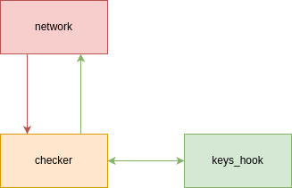

# Умный чайник

Идея весьма абсурдна:

Если дома кто то есть(висят ключи на крючке), то можно включить чайник, если никого дома нет, то чайник не включится

## Цели безопасности

1. Чайник можно включить только при наличии кого-нибудь дома
2. Чайник не может нагреться выше 100 градусов

## Предположения безопасности

1. Крючок с ключами защищен от физического воздействия злоумышленника

## Архитектура

|Компонент|За что отвечает|
|-----|-----|
|`network`|условный прием запросов с интернета и передача в `checker`|
|`checker`|делает запрос на крючок с ключами, если все ок то включает чайник, также может передавать текущую температуру чайника|
|`keys_hook`(в коде `keys`)|крючок с ключами, если ключи на нем висят то разрешает включить чайник(задается в коде `keys.cpp` `status_code = 1` - ключи висят)|
|`kettle`| чайник|